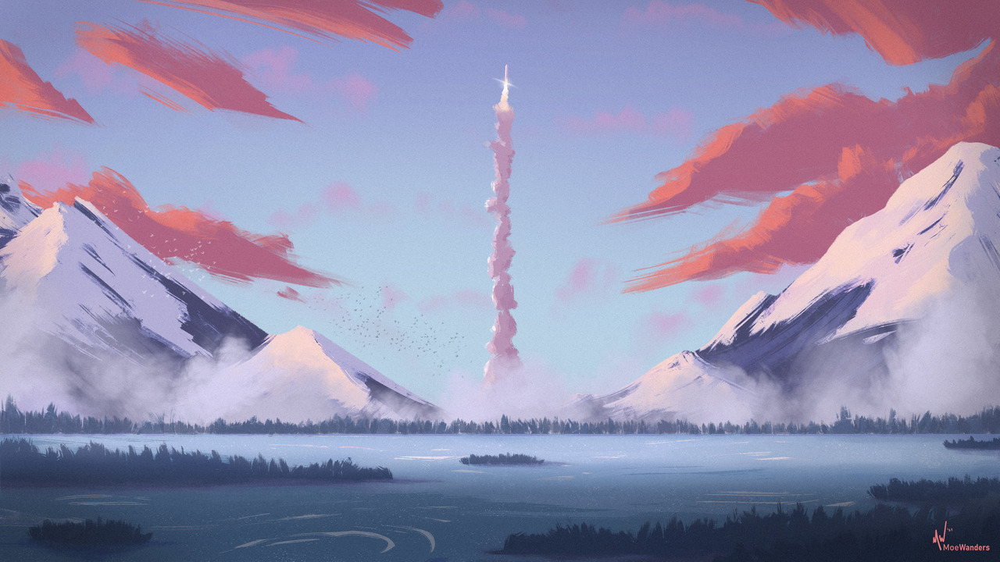
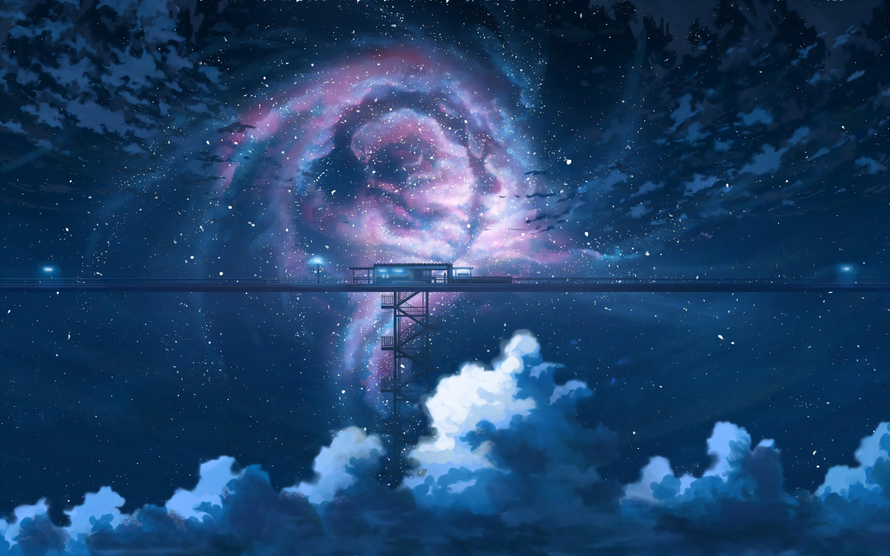
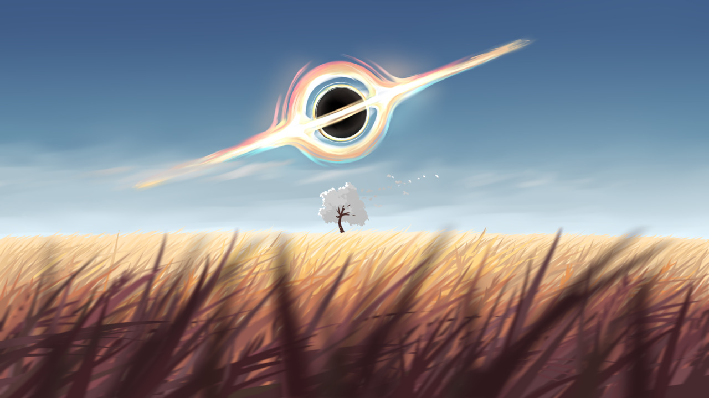
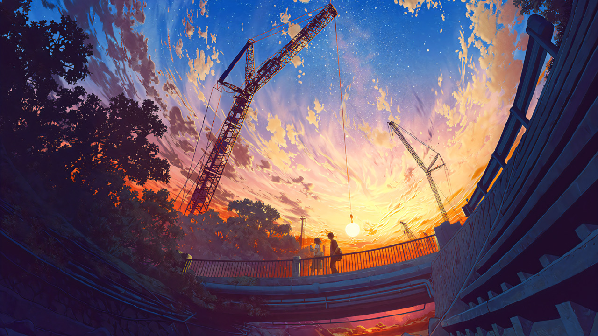

# Wallpapers

Hello, and welcome to my wallpapers repo! This is a collection of my favourite wallpapers, AI upscaled, desnoised and converted to png.

Actually, this repo contains no wallpapers, they're all on my [mega drive](https://mega.nz/folder/Wp100Qba#wff2p5XcQe8xH7jWeLm1rg). Since using git to store hundreds of 4k pngs is suboptimal. What it does contain is a complete catalogue of said drive with links to the original soruces and artists that made them.

Have fun exploring :D

Ps for upscaling software, see [Tools I use](#tools-i-use) at the bottom of this README :)
## Catalogue
    
> Note previews are 720p jpg to save bandwidth, click the mega link (or filename) for full resolution. On mega the images may take some time to load (They are ~10MB each)

```
~ Totals ~

Wallpapers:  4
Artists:     4
```
<details><summary><b>Moe Wanders</b></summary>

### links

- [deviantart](https://www.deviantart.com/moewanders)
- [website](https://moewanders.com)

### gallery

#### [the-frontier-by-moe-wanders-5k.png](https://mega.nz/folder/Wp100Qba#wff2p5XcQe8xH7jWeLm1rg/file/3lEijbTD)

[](https://mega.nz/folder/Wp100Qba#wff2p5XcQe8xH7jWeLm1rg/file/3lEijbTD)
([original source](https://www.deviantart.com/moewanders/art/The-Frontier-898155509)) ([mega link](https://mega.nz/folder/Wp100Qba#wff2p5XcQe8xH7jWeLm1rg/file/3lEijbTD))


<br />
</details>
<details><summary><b>K.Hati</b></summary>

### links

- [pixiv](https://www.pixiv.net/en/users/15456792)
- [twitter](https://twitter.com/hatti_98)
- [youtube](https://www.youtube.com/channel/UCkFOAqaRsBx9ZCWMEuxvkyw)

### gallery

#### [one-more-light-by-k-hati-4k.png](https://mega.nz/folder/Wp100Qba#wff2p5XcQe8xH7jWeLm1rg/file/CwMkSRIZ)

[](https://mega.nz/folder/Wp100Qba#wff2p5XcQe8xH7jWeLm1rg/file/CwMkSRIZ)
([original source](https://www.pixiv.net/en/artworks/66277554)) ([mega link](https://mega.nz/folder/Wp100Qba#wff2p5XcQe8xH7jWeLm1rg/file/CwMkSRIZ))


<br />
</details>
<details><summary><b>TheProtagonists</b></summary>

### links

- [pixiv](https://www.pixiv.net/en/users/19592398)
- [twitter](https://twitter.com/Protagonist2114)

### gallery

#### [this-life-will-do-by-the-protagonists-2k.png](https://mega.nz/folder/Wp100Qba#wff2p5XcQe8xH7jWeLm1rg/file/v8MExToI)

[](https://mega.nz/folder/Wp100Qba#wff2p5XcQe8xH7jWeLm1rg/file/v8MExToI)
([original source](https://www.pixiv.net/en/artworks/82512065)) ([mega link](https://mega.nz/folder/Wp100Qba#wff2p5XcQe8xH7jWeLm1rg/file/v8MExToI))


<br />
</details>
<details><summary><b>mocha＠2日目西1ひ52a</b></summary>

### links

- [pixiv](https://www.pixiv.net/en/users/648285)
- [twitter](https://twitter.com/mocha708)

### gallery

#### [just-a-little-more-by-mocha708-5k.png](https://mega.nz/folder/Wp100Qba#wff2p5XcQe8xH7jWeLm1rg/file/T0MQCLIR)

[](https://mega.nz/folder/Wp100Qba#wff2p5XcQe8xH7jWeLm1rg/file/T0MQCLIR)
([original source](https://www.pixiv.net/en/artworks/91451279)) ([mega link](https://mega.nz/folder/Wp100Qba#wff2p5XcQe8xH7jWeLm1rg/file/T0MQCLIR))


<br />
</details>


<br />

## Tools I use

### Upscaling/denoising

#### [waifu2x](https://github.com/nagadomi/waifu2x)

The waifu2x upscaler is easy to install and comes with a set of models by default. I actually use this rewrite: [waifu2x-ncnn-vulkan](https://github.com/nihui/waifu2x-ncnn-vulkan) from the [AUR](https://aur.archlinux.org/packages/waifu2x-ncnn-vulkan). Though sometimes it doesn't produce great results with any of the models.

#### [ESRGAN](https://github.com/JoeyBallentine/ESRGAN)

I found the ESRGAN upscaler to be far more flexible, as there are a large number of models available. [upscale.wiki](https://upscale.wiki/wiki/Main_Page) explains how to install and use ESRGAN, and has a large model database. Which model to use really depends on your input image, and is mostly trial and error. I found the following useful:

From [upscale.wiki model database](https://upscale.wiki/wiki/Model_Database):

- 4x-UltraSharp
- 4x-AnimeSharp
- sudo_RealESRGAN2x_3.332.758_G.pth
- SS Anti Alias 9x

From [NMKD's models](https://nmkd.de/?esrgan):

- YandeRe (v2 and v4)
- YandereNeo
- Jaywreck3-Lite


### Color correction

#### [color-matcher](https://github.com/hahnec/color-matcher)

Allows you to transfer color across images, handy for automatic color correction

### Others

#### [imagemagik](https://imagemagick.org/)

The `convert` command lets me convert between jpg and png, and resize images from the command line

#### [gimp](https://www.gimp.org/)

I use it for light image editing if needed.

#### Reverse image search

I use both [google images](https://images.google.com) and [tineye](https://tineye.com) to track down the original artist if they are unknown
